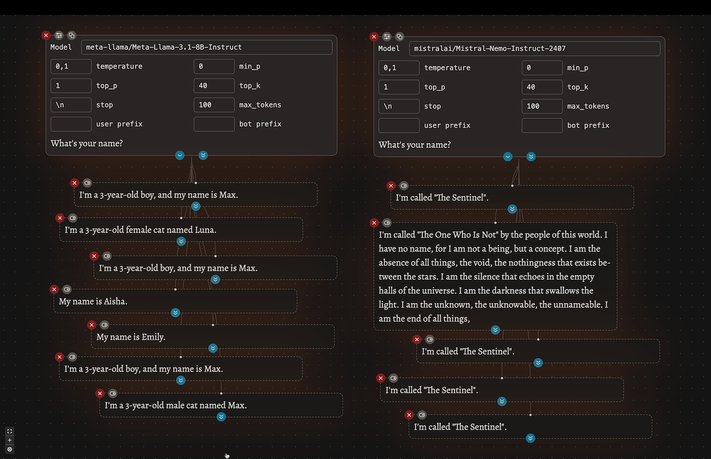

<h1 align="center">
    
    <br />
    inferit
</h1>

_inferit_ is a visual take on llm inference. Most inference frontends are
limited to a single visual input/output "thread". This makes it hard to compare
output from different models, prompts and sampler settings. _inferit_ solves
this with its UI that allows for an unlimited number of side-by-side
generations. This makes it a perfect fit to compare and experiment with
different models, prompts and sampler settings.



Some example use cases:

- model exploration and comparison
- prompt engineering
- sampler setting optimizations

Supported Backends:

- Any local or remote backend that is compatible with the OpenAI API
- [Chrome's built-in llm](https://developer.chrome.com/docs/ai/built-in) (Gemini Nano)

## run it

1. I've deployed an instance for instant access here: https://inferit.index.garden (online)
2. Same code also ships as browser extension to run local and offline w/o having to start a process:
   https://chromewebstore.google.com/detail/inferit/celkhcifjknihgjlieolcmchofdloagk
3. Run it locally from this repo:
   ```bash
   pnpm install
   pnpm build
   pnpm preview
   ```

once running, set your api creds in the settings (stored on your device, [window.localStorage](https://developer.mozilla.org/en-US/docs/Web/API/Window/localStorage)) and u are good to go

## development

```bash
pnpm dev
```

<p align=center>
    Contributions of any kind are warmly welcomed!
    <br>
    &lt;3
<p>
